# Don't Hangme

## Introduction

Don't Hangme is based on the classic Hangman game. In this version, the program randomly selects a word from a list of almost one thousand words for the player to try and figure out. You don't need an opponent to challenge you, this is a single player game, but you can team up with other people to try and guess the answer. The idea is to have a game that is quick, challenging and can be played over and over again. It was made using Python to be played in a terminal. The game is deployed via Heroku and through Code Institute's template, a mock terminal is generated on a web page making it playable in a browser. 

The game can be found <a href="https://dont-hangme.herokuapp.com/" target="_blank">**here**.</a> 

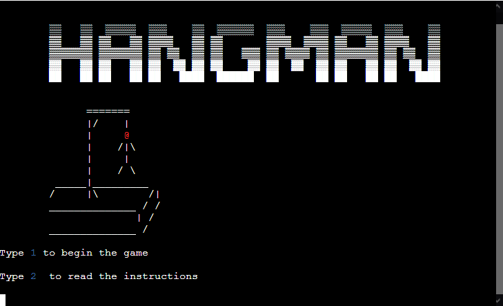

## UX

### Strategy

#### Target Audience
* All ages
* All levels
* English speakers
* English students

#### User Stories
* I want to know how to play the game
* I want to see my progress
* I want to be able to replay many times consecutively

#### Site Objectives
* Provide a game that runs smoothly
* Provide quick yet challenging entertainment
* Provide an easy to use interface

### Scope

Based on the objectives and user stories.

#### Requirements
* Engaging yet easy to understand instructions
* Consistent playthrough, no need to reload page or game
* New word every with every new start

### Structure

The game is run via a mock terminal on a web page. It is constrained to that environment. It's deployed through Heroku which is connected to GitHub.

The user only needs to give single character inputs followed by the Enter key.

### Skeleton

The intention was always to create a game where the player wouldn't have to leave the terminal environment to keep playing as many rounds as they want. They shouldn't have to even touch their mouse.

In order to better visualize and plan the game cycle, I developed a flow chart to organize the functions and keep them in logical order. This way I could see where the game might run into a wall and programmed accordingly in order to keep it flowing.

Here is the logic flow for Don't Hangme:

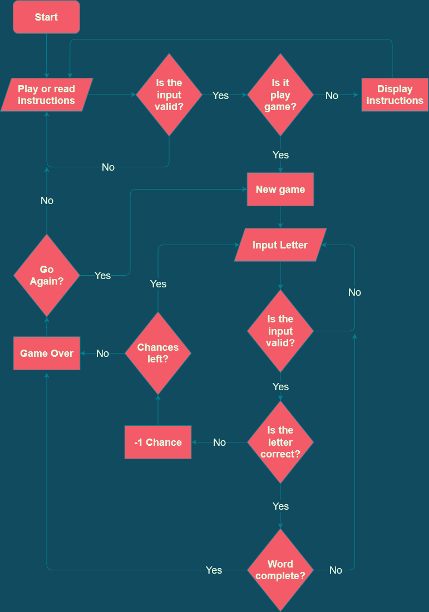

### Surface

Considering that the objective of this project was to make a Python program to be run via terminal, no HTML or CSS (aside from the basic provided by the Code Institute template) was used. All of the graphic design is in-game in the form of ASCII Art, it is visible in the stylized way the title, win and fail messages are written as well as the gallows and the man. In order to not have a dull looking game with nothing but lines of words and characters, a visual representation was necessary to make the experience more enjoyable.

The hangman:

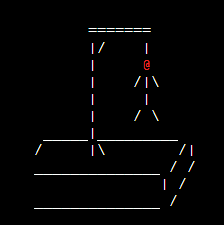

## Features 

Taking into consideration everything from the UX section of the project, I decided what had to be implemented. 

#### Main Menu

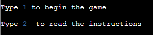

This is the first choice the player has to make, they can either start the game right away if they are already familiar with it or go read the instructions first.

#### Instructions

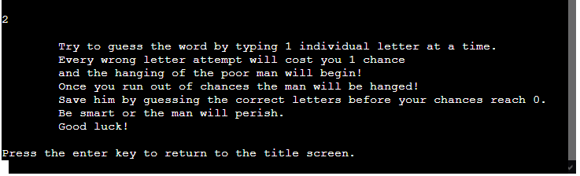

After the title screen, if the player selects the option to read the instructions this is what will come up on the terminal. A slightly themed way of explaining how to play the game. Here the player will have to hit the Enter key, which will take them back to the main menu where they can start their game.

#### Game Started

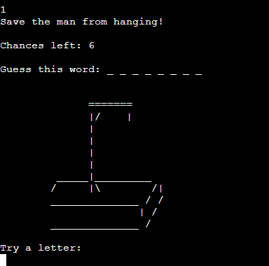

As soon as the game is started the status becomes visible. The player can see how many chances they have left, how many letters are in the word to be guessed and the empty gallows indicating 0 mistakes.

#### Wrong Inputs

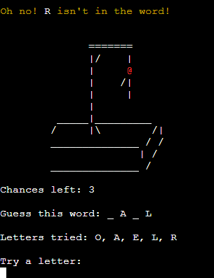

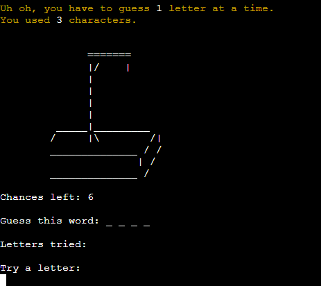

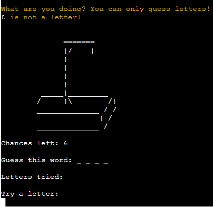

If the user inputs anything other than a single letter while playing the game, they will get a message explaining what they need to do and what they did wrong.

#### Letters Tried

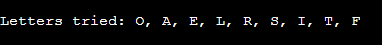

In order to keep track of which letters have been tried, the used ones will be displayed to avoid reuse, the user won't lose any chances if they mistakenly try the same letter again and they will also get a message telling them that they have already used it.

#### Visual Representation Of Chances Taken

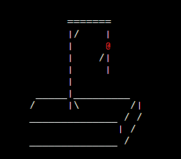

Every choice updates the status by at least adding a new letter to the used bank. When incorrect guesses are made the player also loses a chance which means the man is one step closer to being hanged. With every round an image showing how close he is to hanging will be displayed.

#### Game Over Messages

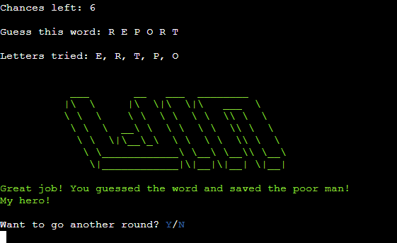

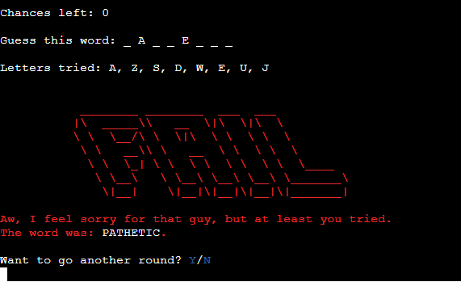

One of these messages will be displayed at the end of the game depending on the result. If the word is guessed correctly, the win message. If they run out of chances, the fail message. Along with the ASCII Art style banner, they will also get a message congratulating or consoling them as well as a prompt to try again, if chosen No, they will be taken back to the title screen.

## Testing

Testing was done throughout the development of the game. With each addition or modification made, I was sure to test the output in the terminal available through Gitpod's environment. Many rounds of hangman have been played during the process.

As can be seen in the [flow chart](#Skeleton) I designed and in the warning messages exhibited in the [Features](#Wrong-Inputs), I tried to make sure the game would be running in circles and never running into a dead end.

During the writing process I kept an eye on the "Problems" tab in Gitpod and made changes to my code constantly to be sure it was clear.

Since this project focused mostly on Python and not page layout and design, there was no need to run it through an HTML or CSS validator, however I did check the Python code in PEP8 which returned no faults.

PEP8 results:

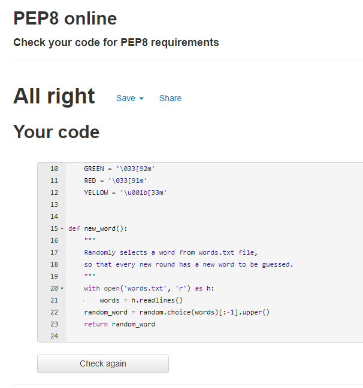

https://www.randomlists.com/random-words generated list of words 

https://www.youtube.com/watch?v=5x6iAKdJB6U select random word from .txt

https://www.youtube.com/watch?v=m4nEnsavl6w hangman tutorial

adding title screen and more ascii art for styling

https://texteditor.com/multiline-text-art/ ascii title 

https://textkool.com/en ascii win/lose message

https://stackoverflow.com/questions/287871/how-to-print-colored-text-to-the-terminal how to add color

https://www.lihaoyi.com/post/BuildyourownCommandLinewithANSIescapecodes.html colors

