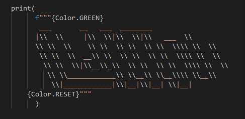

# Don't Hangme - Hangman Game

## Introduction

Don't Hangme is based on the classic Hangman game. In this version, the program randomly selects a word from a list of almost one thousand words for the player to try and figure out. You don't need an opponent to challenge you, this is a single player game, but you can team up with other people to try and guess the answer. The idea is to have a game that is quick, challenging and can be played over and over again. It was made using Python to be played in a terminal. The game is deployed via Heroku and through Code Institute's template, a mock terminal is generated on a web page making it playable in a browser. 

The game can be found [**here**](https://dont-hangme.herokuapp.com/) 

## UX

### Strategy

#### Target Audience
* All ages
* All levels
* English speakers
* English students

#### User Stories
* As a user I want to know how to play the game
* As a user I want to see my progress
* As a user I want to be able to replay many times consecutively

#### Site Objectives
* Provide a game that runs smoothly
* Provide quick yet challenging entertainment
* Provide an easy to use interface

### Scope

Based on the objectives and user stories.

#### Requirements
* Engaging yet easy to understand instructions
* Consistent playthrough, no need to reload page or game
* New word every with every new start

### Structure

The game is run via a mock terminal on a web page. It is constrained to that environment. It's deployed through Heroku which is connected to GitHub.

The user only needs to give single character inputs followed by the Enter key.

### Skeleton

The intention was always to create a game where the player wouldn't have to leave the terminal environment to keep playing as many rounds as they want. They shouldn't have to even touch their mouse.

In order to better visualize and plan the game cycle, I developed a flow chart to organize the functions and keep them in logical order. This way I could see where the game might run into a wall and programmed accordingly in order to keep it flowing.

Here is the logic flow for Don't Hangme:

### Surface

Considering that the objective of this project was to make a Python program to be run via terminal, no HTML or CSS (aside from the basic provided by the Code Institute template) was used. All of the graphic design is in-game in the form of ASCII Art, it is visible in the stylized way the title, win and fail messages are written as well as the gallows and the man. In order to not have a dull looking game with nothing but lines of words and characters, a visual representation was necessary to make the experience more enjoyable.

A little bit of color was added to the program in order to make the warnings, win/lose messages and some options stand apart from the rest of the monochromatic terminal, catching the player's attention. As a side benefit, it makes the game slightly more lively.

The colors I chose were:
*   Blue - To indicate the options to start or restart the game
* Yellow - To warn the user that they have made a mistake
* Red - To tell the user he has failed the objective, also as the man's head to give a sense of urgency
* Green - To tell the user he has succeeded

The hangman:

## Features 

Taking into consideration everything from the UX section of the project, I decided what had to be implemented. 

#### Main Menu

This is the first choice the player has to make, they can either start the game right away if they are already familiar with it or go read the instructions first. The blue makes the options stand out as to what character the user should type when making a decision.

#### Instructions

After the title screen, if the player selects the option to read the instructions this is what will come up on the terminal. A slightly themed way of explaining how to play the game. Here the player will have to hit the Enter key, which will take them back to the main menu where they can start their game.

#### Game Started

As soon as the game is started the status becomes visible. The player can see how many chances they have left, how many letters are in the word to be guessed and the empty gallows indicating 0 mistakes.

#### Wrong Inputs

If the user inputs anything other than a single letter while playing the game, they will get a message explaining what they need to do and what they did wrong. This message will sit at the top of the viewbox and colored yellow so the player can find it easily and still keep all of the their stats visible.

#### Letters Tried

In order to keep track of which letters have been tried, the used ones will be displayed to avoid reuse, the user won't lose any chances if they mistakenly try the same letter again and they will also get a message telling them that they have already used it.

#### Visual Representation Of Chances Taken

Every choice updates the status by at least adding a new letter to the used bank. When incorrect guesses are made the player also loses a chance which means the man is one step closer to being hanged. With every round an image showing how close he is to hanging will be displayed.

#### Game Over Messages

One of these messages will be displayed at the end of the game depending on the result. If the word is guessed correctly, the win message. If they run out of chances, the fail message. Along with the ASCII Art style banner, they will also get a message congratulating or consoling them as well as a prompt to try again, if chosen No, they will be taken back to the title screen. 

The winning message will be displayed in green, and the losing message in red, both colors are usually associated with positive and negative things respectively. The large graphic and color make it clear right away that the game is over, win or lose.

## Testing

Testing was done throughout the development of the game. With each addition or modification made, I was sure to test the output in the terminal available through Gitpod's environment. Many rounds of hangman have been played during the process.

As can be seen in the [flow chart](#Skeleton) I designed and in the warning messages exhibited in the [Features](#Wrong-Inputs), I tried to make sure the game would be running in circles and never running into a dead end.

During the writing process I kept an eye on the "Problems" tab in Gitpod and made changes to my code constantly to be sure it was clear.

Since this project focused mostly on Python and not page layout and design, there was no need to run it through an HTML or CSS validator, however I did check the Python code in PEP8 which returned no faults.

PEP8 results:

The game was tested on Chrome, Firefox and Safari.

### Bugs

* GitHub automatically removes the empty line at the end of the Python file. It is present in my Gitpod workspace but gets removed when pushed to the repository.

* Heroku deployment wouldn't work. I had removed the requirements.txt file because I didn't need to add anything to it, but even though it is empty, it is necessary in order to be deployed by Heroku.

* When doing the ASCII Art, sometimes it would be printed out misaligned. That was due to the use of backslashes to make the art.

This is how the coded ASCII Art for the win message needs to look like in order to come out correctly:

## Technologies

### Languages

* HTML 
    * Code Institute Template
* JavaScript
    * Code Institute Template
* Python
    * Used to create the game's code
* Markdown
    * Used to write this Readme 

### Developer Environment

* GitHub
    * Code hosting platform for version control
* Gitpod
    * Development platform
* Heroku
    * Cloud platform, deploys the app

### Library
 
* Random
    * To randomly get a word from the words.txt file

## Deployment

### Developing

1. Create a new repository on GitHub using Code Institute's Python Essentials Template.
1. Open the repository you just created and from there you can:
    * Create a workspace by prefixing any GitHub URL with gitpod.io/#, or
    * By using Gitpod browser extension, it adds a button to GitHub.
1. Through Gitpod you will push your commits straight to GitHub.

### Deploying

1. Push your code to GitHub.
1. Log in or Sign up to Heroku where you need to create a new app.
1. Select a unique name.
1. In the settings tab reveal the config vars, for this project one had to be added as per Code Institute's guidance.
1. For KEY, input PORT and for VALUE, input 8000 and click add.
1. Below that, click add buildpack, select Python and save.
1. Click add buildpack again, now select Nodejs  and save.
1. Python should be above Nodejs on the buildpacks list.
1. Go to deploy tab and for deployment method select GitHub and connect your GitHub account.
1. When prompted enter the repository you want to deploy, search and once found connect it.
1. Now you can either set it to automatically or manually deploy the appropriate branch.
    * Automatically will deploy the app everytime you push something to GitHub.
    * Manually you have control over when the app should be deployed, but you have to remember to do it.
1. It might take a little while, but once the app is built Heroku will have a link to the live web page.
       
## Credits And References

[Random Lists](https://www.randomlists.com/random-words) - Where I generated my long list for the words.txt file. 

[NeuralNine](https://www.youtube.com/watch?v=5x6iAKdJB6U) - During this tutorial he explains how to get a random word from a .txt file.

[Kite](https://www.youtube.com/watch?v=m4nEnsavl6w ) - Good tutorial on hangman game for Python, where I learned the code to reveal individual letters from the hidden word.

[Text Editor](https://texteditor.com/multiline-text-art/) - Where I found the ASCII Art for the title .

[TextKool](https://textkool.com/en) - Where I found the art for the win and lose messages.

[Stack Overflow](https://stackoverflow.com/questions/287871/how-to-print-colored-text-to-the-terminal) - This helped me figure out how to add color to text in the terminal using Python.

[Li Haoyi](https://www.lihaoyi.com/post/BuildyourownCommandLinewithANSIescapecodes.html) - Here I saw the codes for the colors I used.

